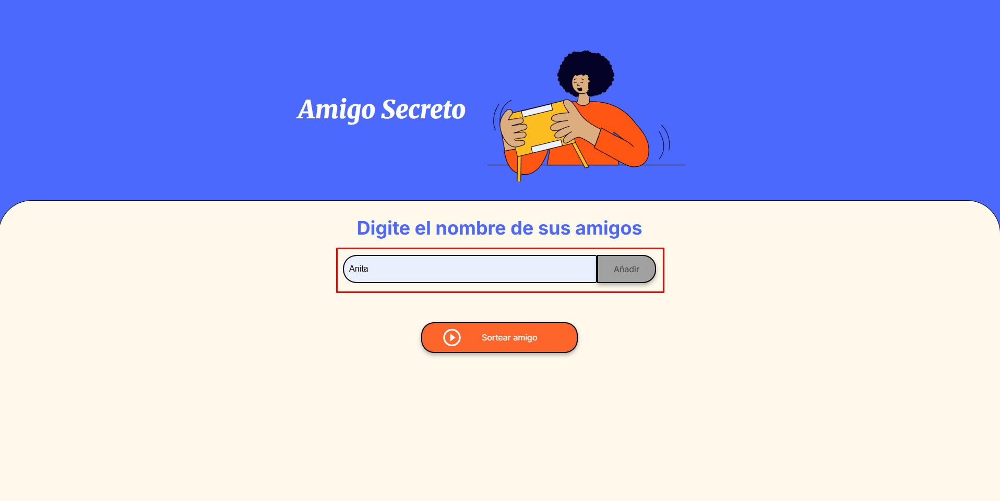
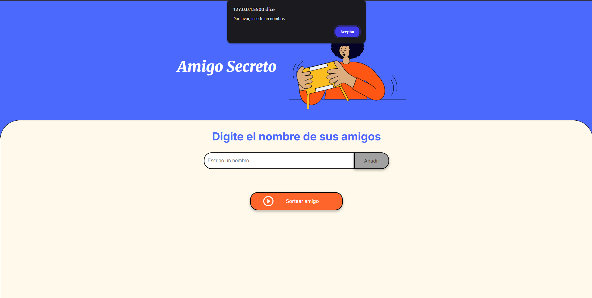
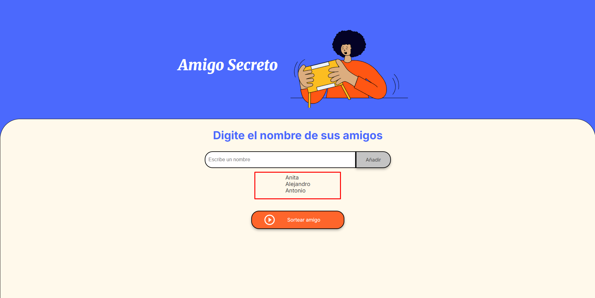
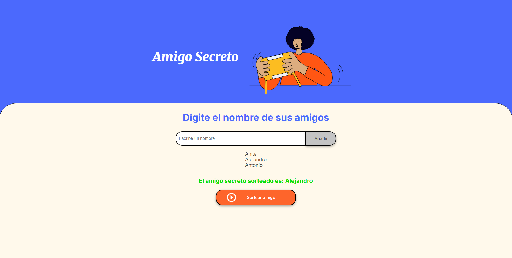

# 🎁 Aplicación Amigo Secreto

## 📋 Índice

- [Descripción](#descripción)
- [Tecnologías](#tecnologías)
- [Características y demostración](#características-y-demostración)
- [Instalación y uso](#instalación-y-uso)
- [Autor](#autor)
- [Licencia](#licencia)

---

## 📌 Descripción

**Aplicación Amigo Secreto** es una herramienta simple y divertida para organizar sorteos de amigo secreto. Permite ingresar nombres de participantes y realizar un sorteo aleatorio para elegir al "amigo secreto" de forma rápida, sin repeticiones y sin complicaciones.

---

## 🛠️ Tecnologías

- HTML  
- CSS  
- JavaScript

---

## ✨ Características y demostración

1. ✅ **Agregar nombres:** Se ingresan mediante un campo de texto y se agregan con el botón "Añadir".
2. ⚠️ **Validación:** Si el campo está vacío, se muestra una alerta para ingresar un nombre válido.
3. 📋 **Visualización:** Los nombres se listan debajo del campo de entrada.
4. 🔄 **Sorteo aleatorio:** Con el botón "Sortear Amigo", se selecciona aleatoriamente un nombre de la lista.
5. 🧼 **Interfaz clara y amigable.**

**Demostración:**

  
 
 
 

---

## 🚀 Instalación y uso

Puedes usar la app directamente desde el siguiente enlace:

👉 [**Ir a la aplicación**](https://krakendevcl.github.io/Amigo-secreto/)

_No requiere instalación._

---

## 👨‍💻 Autor

Desarrollado por **José Antonio Gallegos Carvallo** en conjunto con **Alura Latam** 🚀  
> Proyecto educativo para fortalecer habilidades en desarrollo web.

---

## 📄 Licencia

Este software se distribuye como **Freeware**.

Puedes usarlo libremente con fines personales y educativos.  
No se permite la modificación, redistribución ni uso comercial sin autorización del autor.

© 2025 KrakenDevCL. Todos los derechos reservados.

